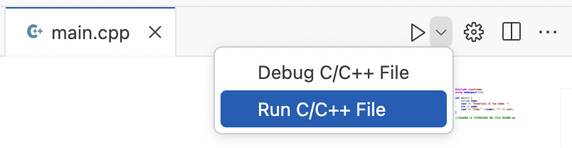

# Istruzioni
**Scrivere il programma**
- Aprire il file main.cpp e modificare il contenuto

**Eseguire il programma**
- Aprire il file main.cpp
- Selezionare l'icona "run" e poi "run C/C++ file" 
 
- aprire TERMINAL per controllare il risultato

**Consegnare su classroom**
- [Source Control] sulla sinistra
- **scrivere il messaggio** "Consegna" **nella casella di testo Message**
- [Commit & Push] dal pulsante dropdown
